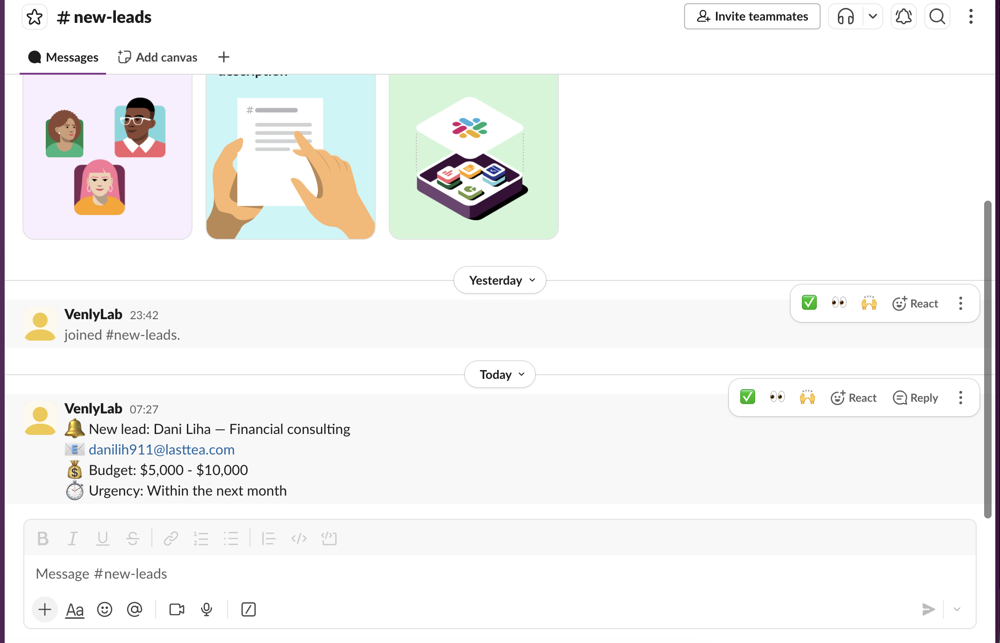
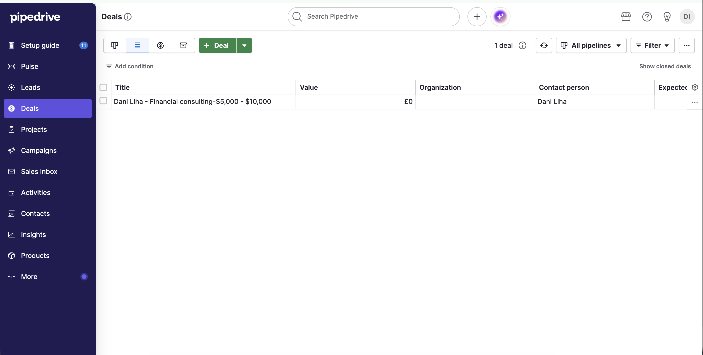
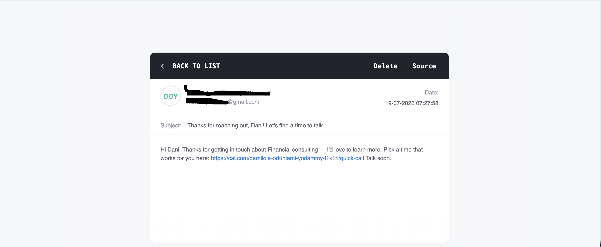
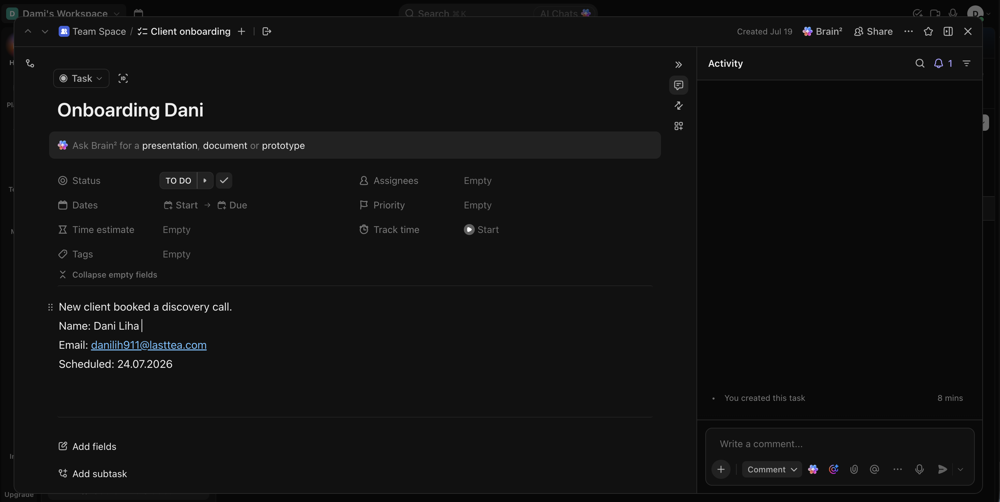

## Tech Stack

- **Make.com** — automation orchestration
- **Typeform** — lead capture form
- **Pipedrive** — CRM
- **Slack** — real-time notifications
- **Gmail** — automated email delivery
- **Cal.com** — self-serve call scheduling
- **ClickUp** — onboarding task management

## Error Handling

Both scenarios include error handlers (Resume/Ignore) on fragile modules — Pipedrive's Person/Deal creation and the ClickUp task creation — so a single malformed field doesn't take down the entire pipeline. A lead is never lost even if one downstream step fails.

## Demo

📹 [Watch the full walkthrough](https://youtu.be/07gYcuviRhw)

## Screenshots

**Slack Notification**

**Pipedrive Deal**

**Booking Email**

**ClickUp Onboarding Task**

## Blueprints

Full Make.com scenario exports are available in [`/blueprints`](./blueprints) for technical review:
- `scenario-1-typeform-to-pipedrive-slack-email.json`
- `scenario-2-calcom-to-clickup.json`
